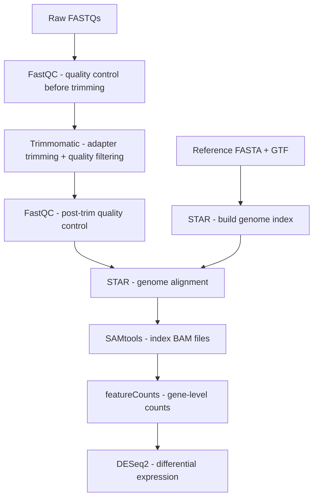

# RNAseq Differential Expression Pipeline

An end-to-end Python pipeline that processes raw RNA-seq reads through quality control, trimming, alignment, and quantification, followed by differential expression analysis with DESeq2.

## Biological Question

This pipeline is demonstrated using an RNA-seq dataset from *Saccharomyces cerevisiae*, investigating whether amphotericin B (AMB) treatment alters gene expression. It is designed to be adaptable to other eukaryotic organisms by updating the reference files, configuration, and tool parameters, though this has not been tested beyond yeast.

## Dataset

- **GEO accession**: GSE80357
- **Organism**: *Saccharomyces cerevisiae* S288C (R64-1-1 reference genome)
- **Samples**: 6 total — 3 AMB treatment replicates, 3 matched controls
- **Sequencing**: Illumina HiSeq 2000, 100bp paired-end
- **Library prep**: TruSeq RNA Library Prep Kit v2 (Illumina)
- **Source**: Pang et al. (2017), *Scientific Reports* — [DOI: 10.1038/srep40232](https://doi.org/10.1038/srep40232)

## Pipeline



## Requirements

### Tools

- **Via conda (miniconda3):** Python, STAR, Trimmomatic, FastQC, SAMtools, featureCounts
- **Installed locally:** R, DESeq2

| Tool | Version |
|---|---|
| Python | 3.9 |
| STAR | 2.5.2b |
| Trimmomatic | 0.40 |
| FastQC | 0.12.1 |
| SAMtools | 1.13 |
| featureCounts (Subread) | 2.0.1 |
| R | 4.2.0 |
| DESeq2 | 1.36.0 |

### Python packages
```
pyyaml
pandas
matplotlib
seaborn
scikit-learn
jupyter
```

Install via conda:
```bash
conda install pyyaml pandas matplotlib seaborn scikit-learn jupyter
```

## Directory Structure

```
rnaseq-pipeline/
├── config/
│   ├── config.yaml        # all pipeline parameters and tool paths
│   └── metadata.csv       # sample info and download URLs
├── data/
│   ├── raw/               # input FASTQs (not tracked in git)
│   ├── interim/           # trimmed FASTQs (not tracked in git)
│   ├── reference/         # genome FASTA and GTF (not tracked in git)
│   └── results/
│       ├── bam/               # BAM files (not tracked in git)
│       ├── fastqc/            # FastQC reports (not tracked in git)
│       ├── trimmed_fastqc/    # post-trim FastQC reports (not tracked in git)
│       ├── featurecounts/     # count files (not tracked in git)
│       ├── deseq2/            # DESeq2 results (tracked in git)
│       └── plots/             # output plots (tracked in git)
├── logs/
│   └── pipeline.log       # run log
├── scripts/
│   └── deseq2.R           # DESeq2 differential expression script
├── pipeline.py            # main pipeline script
└── requirements.txt       # Python dependencies
```

## Usage

### 1. Download reference files

```bash
wget "https://ftp.ensembl.org/pub/release-109/fasta/saccharomyces_cerevisiae/dna/Saccharomyces_cerevisiae.R64-1-1.dna.toplevel.fa.gz" -P data/reference/
wget "https://ftp.ensembl.org/pub/release-109/gtf/saccharomyces_cerevisiae/Saccharomyces_cerevisiae.R64-1-1.109.gtf.gz" -P data/reference/
gunzip data/reference/*.gz
```

### 2. Download FASTQ files

URLs are in `config/metadata.csv`. Download with wget and rename:

```bash
for i in data/raw/*_1.fastq.gz; do mv "$i" "${i/_1/_R1}"; done
for i in data/raw/*_2.fastq.gz; do mv "$i" "${i/_2/_R2}"; done
```

### 3. Configure

Update `config/config.yaml` with your tool paths and system settings.

### 4. Run

```bash
# Mac only — may be required if you encounter a locale error with Trimmomatic
export LANG=en_US.UTF-8
export LC_ALL=en_US.UTF-8

conda activate base
python3 pipeline.py
```

## Output

| File | Description |
|---|---|
| `data/results/fastqc/` | FastQC reports (raw reads) |
| `data/results/trimmed_fastqc/` | FastQC reports (trimmed reads) |
| `data/results/bam/` | Aligned BAM files |
| `data/results/featurecounts/` | Per-sample gene count files |
| `data/results/deseq2/results.csv` | Differential expression results |
| `data/results/deseq2/normalized_counts.csv` | DESeq2 normalized counts |
| `logs/pipeline.log` | Full run log with timestamps |
